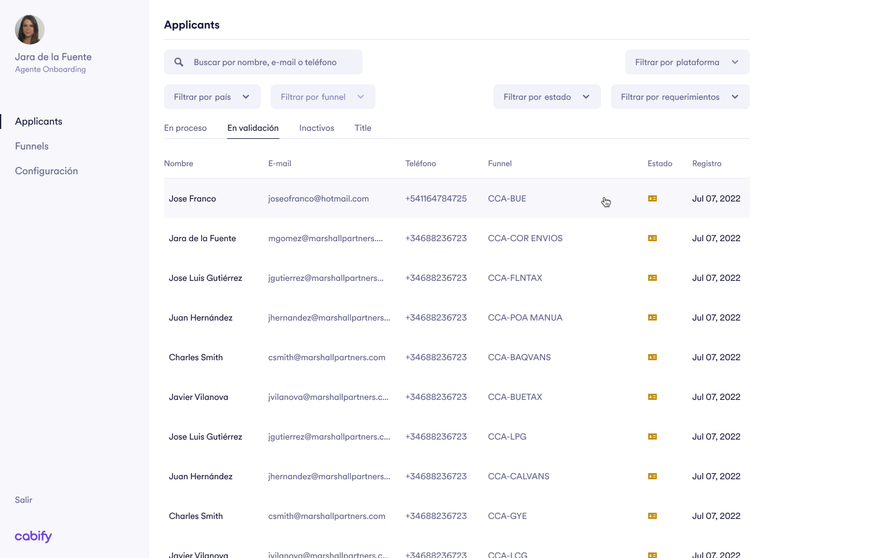

# From Zero to Hero

Very welcome to the project that will try to accompany you to master the Frontend technologies in general and the Cabify Tech Stack in particular.

## Prerequisites

Appetite for learning and a laptop, just that!

## Objective / Goal

We'll start from just a Prisma design and an empty html page and we'll do improving step-by-step, topic by topic until we get the proposal, initially in an agnostic vanilla stack (html + css + vanilla javascript), next we'll move to React and once we achieve that goal we'll finally dive into the Cabify stack just to get the final goal consisting on mimicking the Valkyrie Admin layout.

[Figma design](https://www.figma.com/file/rMkPPEcGtCf6tCvCcb1fIY/202209-%C2%B7-12-Driver-%C2%B7-Valkyrie-%C2%B7-Initiatives-%C2%B7-2022-%C2%B7-%231?node-id=17569-126146&t=PTLkiPgwCFdqxNGj-4)

## Learning plan

We're going to review the following topics theoretically and then we'll get our hands dirty applying them to the project:

1. HTML
2. CSS
3. JS (Basics)
4. JS (Advance)
5. Webpack
6. SCSS
7. EsLint
8. TypeScript
9. React
10. Cabify Libraries
11. Tests
12. Environments & Deployments.
13. Metrics & Analytics.

Some modules could include a set of exercises that you can play with at your own pace before applying them to the project.

## Getting Started

To get started with this plan, simply clone this repository to your local machine and open the `index.html` file in your browser and let's get started.

## Deploying it

We'll use initially the Netlify platform to deploy our progress and make them available online, so, once the project is set up in your GitHub repo we'll connect it to [Netlify](https://www.netlify.com/) and we'll follow the steps to connect your repo to it and get the most of this platform.

## Contributing

These are the tentative initial steps of this plan, so we encourage you to make any suggestion you consider to evolve it and make it better for the people coming after you.
